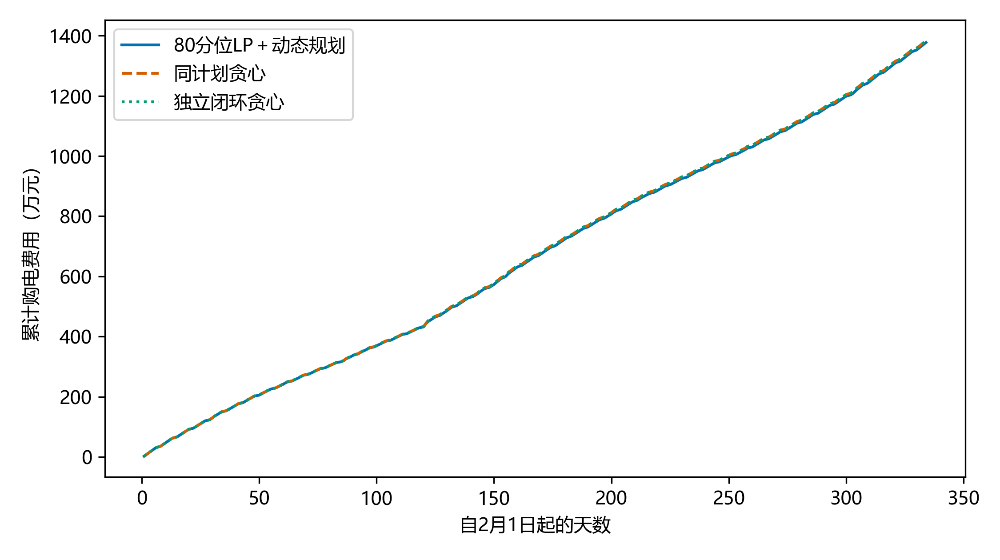

# 第二问：80分位预测与动态规划——从原始附件完整重跑

本次从原始附件1、附件2开始，重新构造特征、训练预测模型、校准分位数、选择控制参数、预热电池及进行全年顺序回测。程序没有读取任何此前预测缓存、调度轨迹或旧汇总结果。实际完成 **2457个LightGBM模型拟合**。

本次主方案总费用为 **13,774,501.34元（1377.450134万元）**。正式评价区间为2025年2月1日至12月31日，共334天、48096个十分钟时段。该数值由本次新运行生成的逐时明细独立复算。

模型的完整路线为：**历史分位数预测 → 固定80分位日前LP → 日内随机动态规划 → 实际SOC跨日接续**。以下分成模型假设、日前阶段、日内阶段与结果四部分，不引用参考文献。

## 一、模型假设与变量

1. 每段十分钟内使用平均功率描述负载及光伏。输入列按区间终点解释：00:10对应00:00—00:10，24:00对应23:50—24:00。
2. 每日零点只利用此前信息确定全天普通购电计划，日内不修改。控制可根据已经得到的观测调整电池，不读取未来实测数据。
3. 沿用当前十分钟功率分段恒定且即时可测的执行假设。这是计算口径，不认定题面已经明确规定该测量机制；如果命令须早于当期观测，需要另行评估延迟信息模型。
4. 充电、放电效率分别为0.9，忽略题目未给参数的自放电与循环衰减。双向各0.9对应往返效率0.81，不能混用。
5. 在题目未给出额外外网容量上限时，允许应急购电补齐剩余缺口。富余可弃用，不计售电收益；实际执行不以应急购电给电池充电。
6. 预测误差以三状态一阶Markov转移及每类最多7个加权样本近似。该离散模型不代表真实误差严格具有Markov性，也不完整保存全部尾部风险。
7. 1月1日零点仅初始化一次6000kWh，之后库存跨日连续。第二问不强加每日首末电量相等，也不每日重置为6000kWh。

以$d$为日期，$t=1,\ldots,144$为时段，$E_{d,t}$表示时段结束时的储电量，$E_{d,0}$表示当日零点电量。一天有144个动作区间、145个库存状态。

$$
\Delta t=\frac16\ \mathrm h,\qquad
X_{d,t}=L_{d,t}-V_{d,t},\qquad N_{d,t}=X_{d,t}\Delta t. \tag{1}
$$

$L,V,X$单位为kW；$N$是净需求电量，单位kWh，允许为负。以下$g,e,c,b,w,E$分别表示普通购电、应急购电、充电、放电、弃用和储电量，均为kWh；用$b$表示放电以避免与日期$d$混淆。$p_t$单位为元/kWh，第二问每天使用附件1同一组时段价格。

## 二、第一阶段：80分位预测与日前购电计划

**第一步：构造只依赖过去的预测特征。** 每天形成25个特征：时段位置及日周期正余弦、星期、周末标记、星期周期正余弦；负载与光伏各自的昨日同刻、上周同刻、近3日均值、近7日均值及标准差、近35日同星期均值、昨日整体均值、近7日整体均值。历史不足时仅使用已经获得的样本。

每个训练日的特征也只能由该训练日以前的数据构造，不能拿训练日完整观测计算其输入特征。每天选此前最多56日训练数据，训练起点不早于1月8日；从1月15日起正式拟合。1月2—14日用昨日同刻值启动历史预测。

**第二步：训练分位数回归。** 同时预测净负荷的$0.20,0.50,0.65,0.80,0.90$五个分位，并分别拟合负载及光伏的中位数。每天7个模型，共351个拟合日，合计2457次拟合。普通购电仅使用80分位，其他分位用于预测中心、尺度与误差描述，不在正式期反选购电分位。

分位数损失写为

$$
\rho_q(u)=\begin{cases}qu,&u\ge0,\\(q-1)u,&u<0.\end{cases} \tag{2}
$$

历史日$j$的样本权重为

$$
\omega_j=2^{-(d-1-j)/28},\qquad
\min_f\sum_{j\in\mathcal T_d}\omega_j\sum_t\rho_q(X_{j,t}-f(\mathbf x_{j,t})). \tag{3}
$$

式（3）是数据拟合项。实现用LightGBM，目标标签除以1000训练、预测后乘回1000；树深4、最多15个叶子、学习率0.05、120轮、最小叶样本48、叶值L2正则参数5。随机种子20260911。每日重新拟合，不加载历史模型文件。

**第三步：选择预测中心并进行误差校准。** 直接净负荷分位预测记为$D_{d,t}^{(q)}$。同时计算分别预测的负载与光伏中位数差：

$$
M_{d,t}=\max(\widehat L_{d,t}^{(0.5)},0)-\max(\widehat V_{d,t}^{(0.5)},0). \tag{4}
$$

用1月15—21日MAE比较直接预测与分开预测，1月22日冻结预测中心方式。本次得到：separate_center。直接预测MAE为228.580994kW，分开预测MAE为188.565284kW。

当分开预测胜出时，在保留直接预测分位间距的同时平移中心：

$$
B_{d,t}^{(q)}=D_{d,t}^{(q)}+M_{d,t}-D_{d,t}^{(0.5)}. \tag{5}
$$

若直接预测胜出，则$B=D$。中心方式冻结前的历史预测保持当时的版本，不回写为事后选中的方式。

将一天分为4个六小时块$\mathcal B_\ell$，取此前最多30日且不早于1月15日的预测误差，按分位数校准：

$$
a_{d,\ell}^{(q)}=Q_q\{X_{j,t}-B_{j,t}^{(q)}:j\in\mathcal H_d,t\in\mathcal B_\ell\},
\quad \widehat X_{d,t}^{(q)}=B_{d,t}^{(q)}+a_{d,\ell}^{(q)}. \tag{6}
$$

不足4个历史日时不加校准项。原始直接分位预测和最终校准分位预测分别逐时排序，消除分位交叉。这里$\widehat X^{(q)}$表示排序后的输出。

**第四步：说明80分位的经济依据。** 暂不考虑储能，若计划购电为$g$、净需求为随机电量$N$，过量无售电收入，则单时段期望费用为

$$
J(g)=pg+5p\mathbb E[(N-g)^+],\qquad g\ge0. \tag{7}
$$

连续分布下，内点最优条件为

$$
J'(g)=p-5p[1-F_N(g)]=0\quad\Longrightarrow\quad F_N(g^*)=0.8. \tag{8}
$$

这给出了偏保守购电的依据，但只适用于无储能的简化特例。有储能时不能机械令$g=Q_{0.8}(N)$。本次按用户指定将

$$
\widetilde N_{d,t}=\widehat X_{d,t}^{(0.8)}\Delta t \tag{9}
$$

作为确定性LP输入，再联合安排购电与储能。这里固定80分位，不把它称为已由全年搜索证明的最优分位。

**第五步：建立日前LP。** 给定该策略真实日初库存$E_{d,0}^{\rm act}$，求解

$$
\min\sum_{t=1}^{144}p_tg_{d,t}, \tag{10}
$$

满足

$$
g_{d,t}+\bar b_{d,t}=\widetilde N_{d,t}+\bar c_{d,t}+\bar w_{d,t}, \tag{11}
$$

$$
\bar E_{d,t}=\bar E_{d,t-1}+0.9\bar c_{d,t}-\frac{\bar b_{d,t}}{0.9},
\quad \bar E_{d,0}=E_{d,0}^{\rm act}, \tag{12}
$$

$$
1200\le\bar E_{d,t}\le10800,\quad
0\le\bar c_{d,t},\bar b_{d,t}\le\frac{5000}{6},\quad
g_{d,t},\bar w_{d,t}\ge0. \tag{13}
$$

横线变量只是生成计划所用的辅助轨迹，不直接作为真实执行动作。该LP不含应急购电变量，也不含终端库存奖励，不强制日末恢复日初电量。

原连续LP没有互斥二元变量，因此不能写成MILP。若某辅助解同时充放电，可令$\delta=\min(\bar c,\bar b/0.9^2)$，同时减少充电$\delta$、放电$0.9^2\delta$，将弃用量增加$(1-0.9^2)\delta$。这样库存递推、购电量和费用均不变，并消除重叠。实际控制使用互斥分支。

利用HiGHS求解后提取$\mathbf g_d$，全天固定。**本次每一天LP的初始库存来自该策略自身前一日实际日末，不借用其他策略的库存。**

## 三、第二阶段：随机动态规划反馈控制

**第一步：估计误差状态及转移。** 对预测误差进行标准化：

$$
\sigma_{d,t}=\max\left\{\frac{\widehat X_{d,t}^{(0.8)}-\widehat X_{d,t}^{(0.2)}}{1.683},100\right\},
\quad z_{j,t}=\frac{X_{j,t}-\widehat X_{j,t}^{(0.5)}}{\sigma_{j,t}}. \tag{14}
$$

$\sigma$单位kW，100kW是尺度下限。尺度换算不等于假设误差正态。按原边界约定划分

$$
S_{j,t}=\begin{cases}1,&z_{j,t}<-0.84,\\2,&-0.84\le z_{j,t}<0.84,\\3,&z_{j,t}\ge0.84.\end{cases} \tag{15}
$$

使用此前最多30日的相邻状态计数。全局计数$C_{ij}$加1平滑，再以当前时段前后各3个时段的历史转移计数$C_{t,ij}$局部修正：

$$
P^{\rm all}_{ij}=\frac{C_{ij}+1}{\sum_h(C_{ih}+1)},\qquad
P_{t,ij}=\frac{C_{t,ij}+3P^{\rm all}_{ij}}{\sum_h(C_{t,ih}+3P^{\rm all}_{ih})}. \tag{16}
$$

边界处截断邻域。$i$表示当前类别，$j$表示下一时段类别。所有计数只来自当日前历史。

**第二步：保留类内加权样本。** 取同一历史窗口中$t$前后各3个时段、属于同一类别的标准化误差。若样本数不超过7，全部等权保留；超过7则单独保留最小和最大值，把中间有序样本分5组，以组均值及组占比表示：

$$
\zeta_{t,i,k}=\frac{1}{|\mathcal G_{t,i,k}|}\sum_{z\in\mathcal G_{t,i,k}}z,
\qquad w_{t,i,k}=\frac{|\mathcal G_{t,i,k}|}{M_{t,i}}. \tag{17}
$$

无样本时三个类别分别使用$-1.4,0,1.4$作为单点回退。当前需求样本为

$$
n_{d,t,i,k}=(\widehat X_{d,t}^{(0.5)}+\sigma_{d,t}\zeta_{t,i,k})\Delta t,
\qquad \sum_k w_{t,i,k}=1. \tag{18}
$$

每个样本分别计算缺口再加权，不先把类别平均成单点，因为

$$
\sum_k w_k(n_k-a)^+\ge\left(\sum_k w_kn_k-a\right)^+. \tag{19}
$$

压缩保留均值与极值，但不完整保存内部尾部损失，仍属于近似。

**第三步：明确实际可行动作。** 暂省日期，令$x$为当前开始库存，$n$为当前需求，$r=n-g_t$。若$r\le0$，优先用富余充电：

$$
c=\min\{-r,5000/6,(10800-x)/0.9\},\quad
b=e=0,\quad w=-r-c,\quad x'=x+0.9c. \tag{20}
$$

若$r>0$，不允许充电或超缺口放电，以时段末库存$x'$为变量：

$$
\max\{1200,x-\min(r,5000/6)/0.9\}\le x'\le x,\quad
b=0.9(x-x'),\quad e=r-b,\quad c=w=0. \tag{21}
$$

这些分支保证充放电互斥、功率上限、库存边界及无应急充电。$e$可以等于零。

**第四步：建立库存价值和Bellman递推。** 令$W_t(x,i)$表示当前库存$x$、当前误差类别$i$已知但类内幅值尚未揭示时，从当前到日末的最小预期应急费用与终端项。终端条件为

$$
W_{145}(x,i)=-\kappa_dx,\qquad
\kappa_d=\begin{cases}\kappa,&d<\text{12月31日},\\0,&d=\text{12月31日}.\end{cases} \tag{22}
$$

日前LP的终端项为零；日内DP是否保留库存价值由本次重新验证的$\kappa$确定。它们是不同位置的参数，不能混写。终端项不计入实际电费。

对$t<144$，先求下一时段类别的条件期望

$$
F_{t,i}(x')=\sum_jP_{t,ij}W_{t+1}(x',j). \tag{23}
$$

最后时段直接使用$F_{144,i}(x')=-\kappa_dx'$。定义当前样本的单步费用算子

$$
\mathcal T_{t,i}(x,n)=\begin{cases}
F_{t,i}(x+0.9c),&n-g_t\le0,\\
\displaystyle\min_{x'\text{满足式（21）}}
\{5p_t[n-g_t-0.9(x-x')]+F_{t,i}(x')\},&n-g_t>0,
\end{cases} \tag{24}
$$

其中$c$由式（20）确定。由后向前递推

$$
W_t(x,i)=\sum_kw_{t,i,k}\mathcal T_{t,i}(x,n_{t,i,k}). \tag{25}
$$

式（25）允许当前样本揭示后动作随之变化，但选择当前动作时，未来类别必须先按式（23）取期望。不能让当前动作依赖尚未出现的未来样本。

当前多放电减少当前应急費用，保留库存则可能减少后续高价时段应急费用。该权衡内生形成储备，不额外添加固定SOC储备公式，也不加入CVaR。

库存价值采用60kWh间隔的161个网格点：

$$
\mathcal E=\{1200,1260,\ldots,10800\}. \tag{26}
$$

网格之间线性插值；实际库存仍连续。对缺口分支检查可行区间端点及内部网格节点，即可求得线性插值近似下的单步最小值。

**第五步：顺序执行并跨日接续。** 每十分钟读取当前真实净需求和SOC，确定误差类别，再将真实需求代入式（20）或（24），只执行当前动作：

$$
E_{d,t}=E_{d,t-1}+0.9c_{d,t}-b_{d,t}/0.9,\qquad
g_{d,t}+e_{d,t}+b_{d,t}=N_{d,t}+c_{d,t}+w_{d,t}. \tag{27}
$$

本实现每天计算价值函数，日内按观测反馈执行，不每十分钟重新拟合预测或更新转移矩阵。名称为随机动态规划反馈控制，不将它写成逐步重新求解完整随机MPC。

一月预热从6000kWh起：首日计划为零，缺口按应急购电处理；随后每天采用昨日净需求正部作为计划并贪心平衡。完成整月后得到2月初库存10800.000kWh。正式期采用

$$
E_{d+1,0}=E_{d,144}, \tag{28}
$$

所有对照从相同一月预热终点出发，之后各自连续运行。

**第六步：重新选择参数并计算账单。** 用1月22—31日对当前“固定80分位、LP无终端项”的架构验证$\kappa$，候选是$0.9\operatorname{mean}(p)$的$0,0.25,0.5,0.75,1,1.25$倍。以统一库存价格$v_{\rm ref}=0.9\operatorname{mean}(p)$计算

$$
J_{\rm val}=C_{\rm val}+v_{\rm ref}(E_{\rm start}-E_{\rm end}). \tag{29}
$$

候选从同一1月22日期初库存出发，参数选择不回写一月实际预热轨迹。并列时取较小$\kappa$，2月1日前冻结。本次选定 **$\kappa=0.000000000$元/电池kWh**，验证表见下一节。

实际总费用独立按账单计算：

$$
C_{\rm total}=\sum_{d=\mathrm{Feb1}}^{\mathrm{Dec31}}\sum_{t=1}^{144}
(p_tg_{d,t}+5p_te_{d,t}). \tag{30}
$$

不扣除虚拟库存价值，不退还未使用的计划购电费用。

## 四、本次新结果、验证与复现

| 方案 | 普通费用/元 | 应急费用/元 | 总费用/元 | 应急电量/kWh | 期末库存/kWh |
|---|---:|---:|---:|---:|---:|
| 80分位LP＋动态规划 | 13,286,808.06 | 487,693.28 | 13,774,501.34 | 91,372.66 | 1350.282 |
| 同计划贪心 | 13,286,808.06 | 545,750.02 | 13,832,558.08 | 91,297.14 | 1350.282 |
| 独立闭环贪心 | 13,286,848.26 | 545,750.02 | 13,832,598.28 | 91,297.14 | 1350.282 |

主方案中，普通购电费为13,286,808.06元，应急购电费487,693.28元；应急电量91,372.66kWh，期末库存1350.282kWh。

“同计划贪心”使用与主方案完全相同的每时段普通购电量，各自维持连续SOC，用于检查日内控制贡献。“独立贪心”每天从自身实际库存解LP，所以它与主方案的费用差同时包含次日计划变化，不能全部归为单次放电控制收益。

本次1月参数验证结果为：

| kappa | 验证账单/元 | 库存调整指标/元 | 期末库存/kWh |
|---|---:|---:|---:|
| 0.000000000 | 508328.53 | 511304.84 | 2226.181 |
| 0.172394375 | 508328.53 | 511304.84 | 2226.181 |
| 0.344788750 | 508328.53 | 511304.84 | 2226.181 |
| 0.517183125 | 508328.53 | 511304.84 | 2226.181 |
| 0.689577500 | 508328.53 | 511304.84 | 2226.181 |
| 0.861971875 | 508328.53 | 511304.84 | 2226.181 |

本次六个候选的验证账单和库存调整指标完全相同，因此1月验证无法识别终端参数的优劣；按事先规定的并列规则选择最小值0。不能把它解释为0被证明优于其他参数。最终方案的日内终端价值因此也为0，但仍通过日内未来费用的Bellman递推安排储能。

预测中位数MAE为247.864300kW，RMSE为371.037311kW；80分位实际覆盖率为79.7842%。这些指标均由本次新预测计算。

题目四个指定日的主方案结果：

| 日期 | 计划费/元 | 应急费/元 | 总费/元 | 日初库存/kWh | 日末库存/kWh |
|---|---:|---:|---:|---:|---:|
| 2025-03-20 | 43082.33 | 492.30 | 43574.64 | 2104.07 | 1587.54 |
| 2025-06-21 | 20192.59 | 0.00 | 20192.59 | 2798.87 | 2997.90 |
| 2025-09-23 | 43831.70 | 0.00 | 43831.70 | 2194.90 | 2368.54 |
| 2025-12-21 | 62149.56 | 0.00 | 62149.56 | 1888.05 | 1621.16 |

图中累计费用按本次逐日账单计算。曲线只反映所测策略，不构成所有预测参数、状态划分或控制策略的最优性证明。

所有策略的供需平衡、SOC递推、功率上限、充放电互斥、无应急充电和跨日连续均通过检查，最大物理残差9.095e-13kWh。日前特征与概率的当前/未来数据扰动检查、执行阶段未来观测扰动检查均通过。类内需求0/100各半、计划50、最低库存的反例返回125元应急期望费用，而非均值替代的0元。各CSV账单和Excel均独立回读复核。

**边界说明：** 当前功率即时可测、三状态一阶转移、最多7个样本和60kWh价值网格仍是近似。1月验证较短，80分位由用户固定，未验证其他分位是劣解。题目数据曾参与先前路线设计，本次独立重训不等于获得新盲测集。报告只使用本次运行结果，不据此宣称全局最优。

### 复现和文件

在仓库根目录安装requirements.txt中的依赖，执行：

~~~powershell
python 代码/实验/q2_fresh_20260912/run_fresh.py --output 代码/实验/q2_fresh_20260912/results_new
~~~

默认读取“基础数据/C题/附件”或“基础数据”下的附件1、附件2，也可以通过--data-dir明确指定。输出目录必须为空；程序拒绝加载或覆盖已有结果。文稿脚本write_report.py读取本次results目录生成报告。

- fresh_engine.py：独立预测、LP、Markov及Bellman函数，不依赖旧实验目录。
- run_fresh.py：完整数据读取、2457次拟合、验证、回测、输出和检查。
- results/training_trace.csv：每个预测日、训练起止日与实际拟合计数。
- results/fresh_forecasts.npz：本次新预测输出，仅为交付物，重跑时不加载它。
- results/main_intervals.csv：主方案48096行逐时明细。
- results/daily_summary.csv：全部策略每日费用与首末库存。
- results/result2.xlsx：计划、充放电、应急购电、逐时明细及四个指定日。
- results/controller_selection.json：本次重新进行的参数验证。
- results/manifest.json：原始附件及源码SHA256、环境、结果、验证和运行记录。

本次完整运行退出码0，用时690.82秒；本次拟合数2457，读取旧预测文件数0，读取旧结果文件数0。报告与数据供审核，未作全局最优或自动满足竞赛提交条件的声明。
