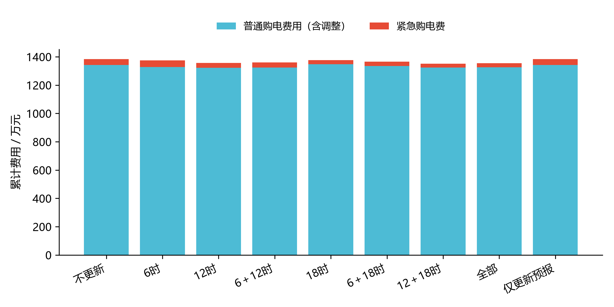
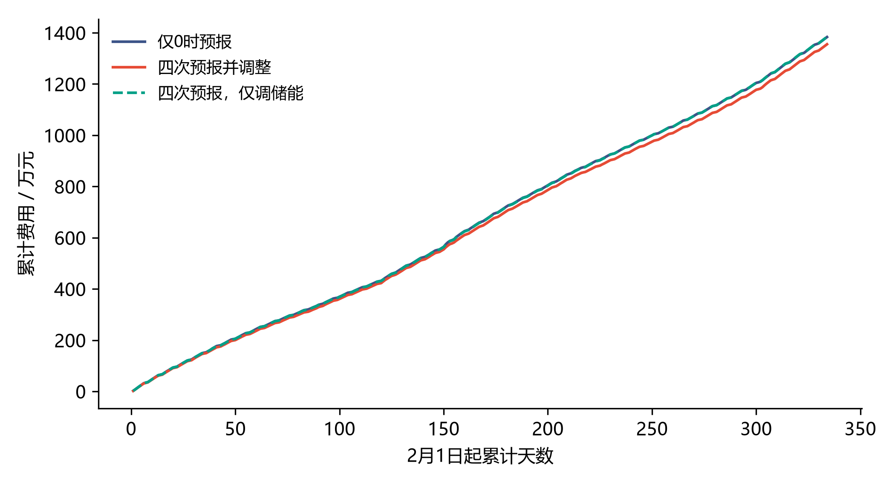

# 第三问路线A：真实回测结果审核

状态：计算与交付核验完成，等待用户审核结果；本文件是结果审核报告，未替代正式Word论文章节。

**结算前提：撤销量退还原价后缴50%违约费，增购按1.5倍，每次对上一有效计划逐笔结算。该解释已随路线A确认，属于建模口径，不是额外取得的官方释义。**

负载预测复用队友新版第二问的已验证前推结果；本次没有重新训练LightGBM。附件3各次PV预报、条件净误差、LP调整候选、DP及所有第三问实际调度重新计算。原题目、模板及所用第二问代码/结果哈希前后保持一致；第二问源码仅Git换行差异经LF归一核验。

评价区间为2025年2月1日至12月31日，共334天。主方案预先定义为四次使用预报，日内三次均可选择保持计划不变，并非事后选全年最优组合。主方案总费用 **13,551,983.07元**，紧急购电 **58,189.48kWh**。

| 费用项 | 金额/元 |
|---|---:|
| 0时初始计划费 | 13,459,275.07 |
| 后续增购费（1.5倍） | 237,502.63 |
| 撤销量退款（扣减） | 865,433.61 |
| 撤销违约费（0.5倍） | 432,716.81 |
| 紧急购电费（5倍） | 287,922.17 |
| 合计 | 13,551,983.07 |

账单恒等式：初始费＋增购费−退款＋违约费＋紧急费。最终普通购电量为20,818,061.87kWh，不能再乘原价重复记费。

| 使用预报时刻 | 总费用/元 | 紧急费/元 | 紧急电量/kWh | 期末库存/kWh |
|---|---:|---:|---:|---:|
| 仅0时 | 13,833,388.74 | 402,062.54 | 73,666.53 | 1,452.71 |
| 0、6时 | 13,754,995.34 | 468,943.32 | 86,561.96 | 1,292.83 |
| 0、12时 | 13,563,711.84 | 346,826.91 | 65,114.24 | 1,292.83 |
| 0、6、12时 | 13,603,732.19 | 368,971.97 | 69,395.82 | 1,292.83 |
| 0、18时 | 13,766,664.76 | 285,243.37 | 58,230.75 | 1,292.83 |
| 0、6、18时 | 13,654,223.71 | 310,577.22 | 63,856.44 | 1,292.83 |
| 0、12、18时 | 13,519,925.24 | 277,354.46 | 55,729.53 | 1,292.83 |
| 四次预报并调整 | 13,551,983.07 | 287,922.17 | 58,189.48 | 1,292.83 |
| 四次预报、购电固定 | 13,841,473.37 | 411,109.54 | 83,458.06 | 1,452.71 |

为直接回答是否增加其他预报时刻，以下在已使用另外两个日内时刻的基础上，计算增加剩余时刻后的费用变化。负数表示节省，正数表示增加费用。

| 新增调整时刻 | 原先日内时刻 | 费用变化/元 |
|---|---|---:|
| 6:00 | 12、18时 | +32,057.83 |
| 12:00 | 6、18时 | -102,240.64 |
| 18:00 | 6、12时 | -51,749.12 |

在本次近似控制及结算口径下，12时和18时更新具有正的组合收益；在已使用12、18时的基础上增加6时，全年费用反而上升。此结论限定于本次数据和参数，不能写成6时预报在所有情况下都无用。


与同样利用附件3零点预报、全天固定购电的对照相比，对照费用减去主方案费用为281,405.67元，主方案相对费用变化为-2.0342%。八个组合中样本期总费最低为“0、12、18时”；这一排序是整段回测描述，不能当作事前知道的最优选择。

“更新预报但不改购电计划”的对照总费13,841,473.37元。它每天从自身实际日初库存制定计划，用于区分更新信息作用和允许交易的作用；长期差异还包含跨日库存导致的次日计划变化，不能全部归为某一次储能控制。

队友新版第二问总费13,774,501.34元。与第三问零点预报固定计划对照相比，差额为-58,887.40元；该差额同时包含外部PV预报和相应净误差校准变化，不能全归因于日内调整。



图中普通购电费用已经合并增购、退款及违约费，紧急费用独立列出。对应数值见summary.json和逐日账单。



累计曲线只比较已定义的可执行策略；没有事后逐日选取最便宜策略。

## 指定日期与交付表

| 日期 | 初始费/元 | 调整净费用/元 | 紧急费/元 | 总费/元 | 日初/日末库存kWh |
|---|---:|---:|---:|---:|---|
| 2025-03-20 | 43,896.50 | -14.43 | 382.14 | 44,264.21 | 1901.35 / 1403.35 |
| 2025-06-21 | 20,939.90 | -462.91 | 0.00 | 20,476.99 | 2887.86 / 2533.44 |
| 2025-09-23 | 46,867.72 | -2,094.93 | 500.62 | 45,273.41 | 1584.95 / 1568.51 |
| 2025-12-21 | 63,270.18 | 56.07 | 1,437.32 | 64,763.57 | 1437.03 / 1433.83 |

result3.xlsx保留官方四张工作表并补齐全年数据，增加逐笔账本、四次计划快照、十分钟明细、费用表及指定日表。输入结束时标按用户已确认口径映射为00:00—00:10至23:50—24:00，原模板未改。紧急购电按连续时段合并。

## 已完成的验证与边界

独立逐笔重放账本、物理约束及跨日连续通过，最大物理残差为9.095e-13kWh。CSV及Excel保存后回读一致。加速DP与原标量DP全网格对比、125元类内缺口反例、120元撤销再买回账单、发布时刻因果扰动及固定计划退化检查通过。

| 日期 | 精度设置 | 总费/元 | 末库存/kWh |
|---|---|---:|---:|
| 2025-03-20 | nominal | 44264.2136 | 1403.3510 |
| 2025-03-20 | grid_30kwh | 44338.6215 | 1403.3510 |
| 2025-03-20 | atoms_15 | 44264.2136 | 1403.3510 |
| 2025-06-21 | nominal | 20476.9897 | 2533.4413 |
| 2025-06-21 | grid_30kwh | 20476.9897 | 2533.4413 |
| 2025-06-21 | atoms_15 | 20476.9897 | 2533.4413 |
| 2025-09-23 | nominal | 45273.4109 | 1568.5138 |
| 2025-09-23 | grid_30kwh | 45273.4109 | 1568.5138 |
| 2025-09-23 | atoms_15 | 45273.4109 | 1568.5138 |
| 2025-12-21 | nominal | 64763.5687 | 1433.8289 |
| 2025-12-21 | grid_30kwh | 64159.1061 | 1264.5430 |
| 2025-12-21 | atoms_15 | 64766.0078 | 1433.8289 |

四日精度变动下最大费用差为604.46元；网格细化会改变个别调整候选和轨迹，因此尚不能宣称调度对离散精度不敏感。


精度检查从主方案该日相同日初库存开始，重新优化该日；它只支持四个指定日的局部敏感性，不证明全年网格误差上界。

仍有明确近似：当前十分钟平均功率即时可测；整点PV线性插值；三状态一阶转移、类内7点压缩、60kWh价值网格；有限分位候选；当前评价暂不预知下一次交易；每日规划止于24:00且终端系数固定0。没有声称全局最优。既有全年数据参与过方法探索，本次也不是新的盲测集。

## 复现

在项目根目录，用已安装numpy、scipy、lightgbm及openpyxl的Python运行：

```powershell
python 代码/实验/q3_revision_a_20260912/run_q3.py --output 代码/实验/q3_revision_a_20260912/results_new
python 代码/实验/q3_revision_a_20260912/deliver_q3.py --output 代码/实验/q3_revision_a_20260912/results_new
```

run_q3.py拒绝覆盖非空目录；中断后仅在代码、输入和参数完全一致时接受--resume。预测复用来源、输入和输出SHA256、运行命令、环境、耗时和验证记录见manifest.json与复现清单.json。
